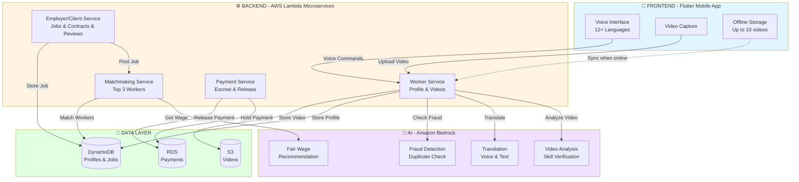
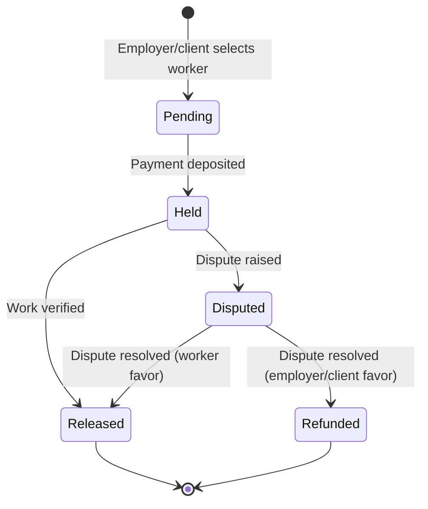

# Design Document: NavAstitva
*Your Work,Your Identity*

## Overview

NavAstitva is a cloud-native, microservices-based platform that leverages Amazon Bedrock for AI capabilities, AWS serverless infrastructure for scalability, and a Flutter-based mobile application for cross-platform accessibility. The system is designed to operate in low-connectivity environments with offline-first capabilities while providing sophisticated AI-powered skill verification, matchmaking, and fraud detection.

The architecture follows a three-tier model:
1. **Presentation Layer**: Flutter mobile app with voice-first UI and offline capabilities
2. **Application Layer**: AWS Lambda functions orchestrating business logic and AI services
3. **Data Layer**: DynamoDB for NoSQL data, S3 for video storage, and RDS for relational data

## Architecture

### System Flow Overview

The platform follows a three-tier architecture with clear separation between Frontend, Backend, and AI layers:



### End-to-End User Journeys

**Journey 1: Worker Onboarding (5 steps)**
1. **FRONTEND**: Worker records skill video with voice narration in local language
2. **BACKEND**: Worker Service receives video and creates profile
3. **AI**: Video Analysis verifies skills, Fraud Detection checks authenticity
4. **BACKEND**: Trust Score calculated (video 40% + ratings 40% + history 20%)
5. **FRONTEND**: Worker receives Skill Trust Card with QR code

**Journey 2: Job & Contract Matching (4 steps)**
1. **FRONTEND**: Employer/client speaks job or contract requirements in any language
2. **BACKEND**: Employer/Client Service creates posting, Matchmaking Service activates
3. **AI**: Fair Wage Engine suggests wage, Translation converts to worker languages
4. **BACKEND**: Top 3 workers matched (skill 40% + trust 30% + location 20% + availability 10%)

**Journey 3: Work & Payment (5 steps)**
1. **BACKEND**: Employer/client selects worker, Payment Service creates escrow
2. **FRONTEND**: Worker accepts, availability auto-updates to "Busy"
3. **FRONTEND**: Worker marks complete, employer/client notified
4. **BACKEND**: Employer/client verifies, Payment Service releases funds
5. **FRONTEND**: Both parties receive SMS, worker's Trust Score updates

### Core Microservices

| Service | Responsibility | Key Operations |
|---------|---------------|----------------|
| **Worker Service** | Profile & skill management | Register, upload video, update availability |
| **Employer/Client Service** | Job & contract posting & reviews | Create posting, submit review, view matches |
| **Matchmaking Service** | AI-powered matching | Rank workers, calculate scores, filter by location |
| **Payment Service** | Escrow & transactions | Hold payment, release funds, handle disputes |
| **Video Processing** | Video analysis pipeline | Compress, analyze skills, detect fraud |
| **Translation Service** | Multilingual support | Transcribe, translate, text-to-speech |

## Components and Interfaces

### 1. Flutter Mobile Application

**Responsibilities:**
- Render voice-first UI with minimal text
- Capture and store videos locally
- Manage offline data synchronization
- Handle voice input/output
- Display worker profiles and job/contract listings

**Key Modules:**

**Voice Interface Module:**
```typescript
interface VoiceInterface {
  // Capture voice input in specified language
  captureVoiceCommand(languageCode: string): Promise<VoiceCommand>
  
  // Convert text to speech in specified language
  speakText(text: string, languageCode: string): Promise<void>
  
  // Recognize voice command and extract intent
  recognizeIntent(audio: AudioBuffer): Promise<Intent>
}

interface VoiceCommand {
  transcript: string
  languageCode: string
  confidence: number
  intent: Intent
}

interface Intent {
  action: string  // e.g., "create_profile", "search_jobs", "upload_video"
  parameters: Map<string, any>
}
```

**Offline Storage Module:**
```typescript
interface OfflineStorage {
  // Store video locally with metadata
  storeVideoLocally(video: VideoFile, metadata: VideoMetadata): Promise<string>
  
  // Queue operation for later sync
  queueOperation(operation: SyncOperation): Promise<void>
  
  // Sync all pending operations when online
  syncPendingOperations(): Promise<SyncResult>
  
  // Cache job/contract listings for offline viewing
  cacheListings(listings: Listing[]): Promise<void>
}

interface SyncOperation {
  id: string
  type: "video_upload" | "profile_update" | "availability_change"
  data: any
  timestamp: number
  retryCount: number
}
```

### 2. Worker Service

**Responsibilities:**
- Worker registration and profile management
- Skill video upload and metadata storage
- Availability status management
- Skill Trust Card generation

**API Endpoints:**

```typescript
interface WorkerServiceAPI {
  // Register new worker with assisted onboarding
  POST /workers/register
  Request: {
    aadhaarNumber: string
    name: string
    phoneNumber: string
    languagePreference: string
    assistedBy?: string  // Onboarding assistant ID
  }
  Response: {
    workerId: string
    verificationStatus: "pending" | "verified"
  }
  
  // Upload skill demonstration video
  POST /workers/{workerId}/videos
  Request: {
    videoFile: File
    skillType: string
    voiceNarration: AudioFile
    languageCode: string
  }
  Response: {
    videoId: string
    processingStatus: "queued" | "processing" | "completed"
  }
  
  // Get worker profile with Trust Score
  GET /workers/{workerId}/profile
  Response: {
    workerId: string
    name: string
    skills: SkillScore[]
    equipmentDeclarations: EquipmentDeclaration[]
    trustScore: number
    reviews: Review[]
    availability: AvailabilityStatus
  }
  
  // Update equipment declaration
  PUT /workers/{workerId}/equipment
  Request: {
    skillType: string
    equipmentStatus: "own_equipment" | "not_available" | "partially_available"
    equipmentDetails?: string
  }
  Response: {
    updated: boolean
    equipmentDeclaration: EquipmentDeclaration
  }
  
  // Update availability status
  PUT /workers/{workerId}/availability
  Request: {
    status: "available" | "busy" | "not_available"
    availableFrom?: Date
    preferredLocations: string[]
  }
  
  // Generate Skill Trust Card
  GET /workers/{workerId}/trust-card
  Response: {
    qrCode: string
    pdfUrl: string
    trustScore: number
    verifiedSkills: string[]
  }
}

interface SkillScore {
  skillType: string
  score: number  // 0-100
  videoCount: number
  lastUpdated: Date
}
```

### 3. Employer/Client Service

**Responsibilities:**
- Employer/client account management
- Job and contract posting creation
- Worker selection and hiring
- Review and rating submission

**API Endpoints:**

```typescript
interface EmployerClientServiceAPI {
  // Create job or contract posting
  POST /employers/{employerId}/postings
  Request: {
    workType: "job" | "contract"
    skillRequired: string
    location: string
    duration: string
    budgetRange: {min: number, max: number}
    description: string
    voiceDescription?: AudioFile
    equipmentRequired?: boolean
    equipmentProvidedByEmployer?: boolean
  }
  Response: {
    postingId: string
    fairWageRecommendation: {min: number, max: number}
    topMatches: WorkerMatch[]
  }
  
  // Generate digital contract using AI
  POST /employers/{employerId}/contracts/{contractId}/generate
  Request: {
    workerId: string
    postingId: string
    scopeOfWork: string
    duration: string
    agreedWage: number
    customTerms?: string
  }
  Response: {
    contractId: string
    digitalContract: DigitalContract
    contractDocumentUrl: string
    aiGeneratedClauses: {
      safetyResponsibilities: string
      workConditions: string
      disputeResolution: string
    }
  }
  
  // Sign digital contract
  POST /contracts/{contractId}/sign
  Request: {
    signedBy: string  // workerId or employerId
    signatureHash: string
  }
  Response: {
    contractStatus: "pending_signature" | "signed"
    bothPartiesSigned: boolean
  }
  
  // Get matched workers for a posting
  GET /employers/{employerId}/postings/{postingId}/matches
  Response: {
    matches: WorkerMatch[]
  }
  
  // Select worker for posting
  POST /employers/{employerId}/postings/{postingId}/select
  Request: {
    workerId: string
  }
  Response: {
    contractId: string
    escrowStatus: "pending" | "held"
  }
  
  // Submit review after work completion
  POST /employers/{employerId}/contracts/{contractId}/review
  Request: {
    rating: number  // 1-5
    reviewText?: string
    voiceReview?: AudioFile
  }
  Response: {
    reviewId: string
    workerTrustScoreUpdated: boolean
  }
}

interface WorkerMatch {
  workerId: string
  name: string
  trustScore: number
  skillScore: number
  distance: number  // km
  matchScore: number  // 0-100
  estimatedResponseTime: string
}
```

### 4. Video Processing Service

**Responsibilities:**
- Video upload and compression
- AI-powered skill verification
- Fraud and plagiarism detection
- Video metadata extraction

**Processing Pipeline:**

```typescript
interface VideoProcessingService {
  // Process uploaded video through AI pipeline
  processVideo(videoId: string): Promise<VideoAnalysisResult>
  
  // Check for duplicate or plagiarized content
  detectFraud(videoId: string): Promise<FraudDetectionResult>
  
  // Extract skill indicators from video
  analyzeSkillDemonstration(videoId: string): Promise<SkillAnalysis>
}

interface VideoAnalysisResult {
  videoId: string
  skillScore: number
  toolsDetected: string[]
  safetyProtocolsFollowed: boolean
  techniqueQuality: number
  fraudRisk: "low" | "medium" | "high"
  processingTime: number
}

interface FraudDetectionResult {
  isDuplicate: boolean
  similarVideos: string[]
  deepfakeScore: number
  metadataConsistent: boolean
  requiresManualReview: boolean
}

interface SkillAnalysis {
  skillType: string
  correctToolUsage: boolean
  safetyScore: number
  techniqueScore: number
  completionScore: number
  overallScore: number
}
```

**Video Processing Lambda Function:**

```python
# Pseudocode for video processing
function processVideoLambda(event):
    videoId = event.videoId
    s3Key = event.s3Key
    
    # Download video from S3
    videoFile = s3.getObject(bucket, s3Key)
    
    # Compress video if needed
    if videoFile.size > MAX_SIZE:
        videoFile = compressVideo(videoFile)
        s3.putObject(bucket, s3Key, videoFile)
    
    # Extract frames for analysis
    frames = extractKeyFrames(videoFile, frameCount=10)
    
    # Call Amazon Bedrock for video analysis
    analysisResult = bedrockClient.invokeModel(
        modelId="anthropic.claude-3-sonnet",
        body={
            "images": frames,
            "prompt": "Analyze this skill demonstration video. Identify: 1) Tools being used, 2) Safety protocols followed, 3) Technique quality (1-10), 4) Overall skill level (1-100)"
        }
    )
    
    # Check for fraud
    fraudResult = detectFraud(videoId, videoFile)
    
    # Calculate skill score
    skillScore = calculateSkillScore(analysisResult, fraudResult)
    
    # Update DynamoDB with results
    dynamodb.updateItem(
        table="Videos",
        key={"videoId": videoId},
        updates={
            "skillScore": skillScore,
            "analysisResult": analysisResult,
            "fraudRisk": fraudResult.riskLevel,
            "processingStatus": "completed"
        }
    )
    
    return {
        "videoId": videoId,
        "skillScore": skillScore,
        "status": "completed"
    }
```

### 5. AI Matchmaking Service

**Responsibilities:**
- Match workers to job/contract postings
- Calculate match scores based on multiple factors
- Rank and filter candidates
- Provide fair wage recommendations

**Matchmaking Algorithm:**

```python
# Pseudocode for matchmaking algorithm
function matchWorkersToPosting(postingId):
    posting = getPosting(postingId)
    
    # Get all available workers with required skill
    workers = queryWorkers(
        skillType=posting.skillRequired,
        availability="available",
        maxDistance=50  # km from posting location
    )
    
    # Filter by equipment if required
    if posting.equipmentRequired and not posting.equipmentProvidedByEmployer:
        workers = workers.filter(w => 
            w.equipmentDeclarations.find(e => 
                e.skillType == posting.skillRequired and 
                e.equipmentStatus == "own_equipment"
            )
        )
    
    matches = []
    for worker in workers:
        # Calculate match score components
        skillMatch = calculateSkillMatch(worker, posting)
        trustScore = worker.trustScore
        proximity = calculateProximity(worker.location, posting.location)
        availability = worker.availabilityScore
        equipmentBonus = calculateEquipmentBonus(worker, posting)
        
        # Weighted match score with equipment consideration
        matchScore = (
            skillMatch * 0.35 +
            trustScore * 0.30 +
            proximity * 0.20 +
            availability * 0.10 +
            equipmentBonus * 0.05
        )
        
        matches.append({
            "workerId": worker.id,
            "matchScore": matchScore,
            "skillScore": skillMatch,
            "trustScore": trustScore,
            "distance": proximity,
            "hasEquipment": hasRequiredEquipment(worker, posting)
        })
    
    # Sort by match score and return top 3
    matches.sort(key=lambda x: x.matchScore, reverse=True)
    return matches[:3]

function calculateEquipmentBonus(worker, posting):
    if not posting.equipmentRequired:
        return 0
    
    equipment = worker.equipmentDeclarations.find(e => e.skillType == posting.skillRequired)
    
    if not equipment:
        return 0
    
    if equipment.equipmentStatus == "own_equipment":
        return 100
    elif equipment.equipmentStatus == "partially_available":
        return 50
    else:
        return 0

function calculateSkillMatch(worker, posting):
    # Find worker's skill score for required skill
    skillScore = worker.skills.find(s => s.skillType == posting.skillRequired)
    
    if not skillScore:
        return 0
    
    # Normalize to 0-100
    return skillScore.score

function calculateProximity(workerLocation, postingLocation):
    distance = haversineDistance(workerLocation, postingLocation)
    
    # Score decreases with distance (max 50km)
    if distance > 50:
        return 0
    
    return (50 - distance) / 50 * 100
```

### 6. Payment and Escrow Service

**Responsibilities:**
- Hold payments in escrow
- Release payments upon work completion
- Handle disputes
- Process refunds

**Escrow State Machine:**



**API Endpoints:**

```typescript
interface PaymentServiceAPI {
  // Create escrow for contract
  POST /payments/escrow
  Request: {
    contractId: string
    employerId: string
    workerId: string
    amount: number
  }
  Response: {
    escrowId: string
    status: "pending"
    paymentUrl: string
  }
  
  // Mark work as complete (worker action)
  POST /payments/escrow/{escrowId}/complete
  Request: {
    workerId: string
    completionProof?: string
  }
  Response: {
    status: "awaiting_verification"
  }
  
  // Verify and release payment (employer/client action)
  POST /payments/escrow/{escrowId}/verify
  Request: {
    employerId: string
    verified: boolean
  }
  Response: {
    status: "released" | "disputed"
    transactionId?: string
  }
  
  // Raise dispute
  POST /payments/escrow/{escrowId}/dispute
  Request: {
    raisedBy: string  // workerId or employerId
    reason: string
  }
  Response: {
    disputeId: string
    status: "under_review"
  }
}
```

### 7. AI Contract Generation Service

**Responsibilities:**
- Generate contextually appropriate contract terms using AI
- Customize safety requirements based on skill type
- Ensure legal compliance with Indian labor laws
- Translate contracts to multiple languages
- Maintain contract templates and legal standards

**AI Contract Generation Pipeline:**

```python
# Pseudocode for AI contract generation
function generateDigitalContract(contractRequest):
    posting = getPosting(contractRequest.postingId)
    worker = getWorker(contractRequest.workerId)
    employer = getEmployer(contractRequest.employerId)
    
    # Build context for AI
    context = {
        "skillType": posting.skillRequired,
        "workScope": contractRequest.scopeOfWork,
        "duration": contractRequest.duration,
        "wage": contractRequest.agreedWage,
        "workerExperience": worker.experienceLevel,
        "location": posting.location,
        "equipmentRequired": posting.equipmentRequired
    }
    
    # Call Amazon Bedrock to generate contract clauses
    aiResponse = bedrockClient.invokeModel(
        modelId="anthropic.claude-3-sonnet",
        body={
            "prompt": f"""Generate a legally compliant work contract for Indian labor laws with the following details:
            
            Skill Type: {context.skillType}
            Work Scope: {context.workScope}
            Duration: {context.duration}
            Agreed Wage: ₹{context.wage}
            Location: {context.location}
            
            Generate the following sections:
            1. Safety Responsibilities (specific to {context.skillType})
            2. Work Conditions (appropriate for {context.duration} duration)
            3. Dispute Resolution Terms (fair to both parties)
            4. Equipment Responsibilities (worker owns: {context.equipmentRequired})
            
            Ensure compliance with:
            - Indian Contract Act, 1872
            - Payment of Wages Act, 1936
            - Minimum Wages Act, 1948
            - Occupational Safety, Health and Working Conditions Code, 2020
            
            Use simple, clear language suitable for workers with limited literacy.
            """,
            "max_tokens": 2000
        }
    )
    
    # Parse AI response
    aiClauses = parseAIResponse(aiResponse)
    
    # Translate to worker's and employer's languages if needed
    if worker.languagePreference != "en":
        aiClauses.safetyResponsibilities = translateText(
            aiClauses.safetyResponsibilities,
            targetLanguage=worker.languagePreference
        )
        aiClauses.workConditions = translateText(
            aiClauses.workConditions,
            targetLanguage=worker.languagePreference
        )
    
    # Create digital contract
    contract = {
        "contractId": generateContractId(),
        "generatedDate": now(),
        "scopeOfWork": contractRequest.scopeOfWork,
        "duration": contractRequest.duration,
        "agreedWage": contractRequest.agreedWage,
        "paymentTerms": generatePaymentTerms(contractRequest.agreedWage),
        "safetyResponsibilities": aiClauses.safetyResponsibilities,
        "workConditions": aiClauses.workConditions,
        "disputeResolutionTerms": aiClauses.disputeResolution,
        "equipmentResponsibilities": generateEquipmentClause(context),
        "workerSignature": null,
        "employerSignature": null,
        "verified": false
    }
    
    # Store contract in database
    saveContract(contract)
    
    # Generate PDF document
    contractPdfUrl = generateContractPDF(contract)
    
    return {
        "contractId": contract.contractId,
        "digitalContract": contract,
        "contractDocumentUrl": contractPdfUrl,
        "aiGeneratedClauses": aiClauses
    }

function generatePaymentTerms(wage):
    return f"""Payment Terms:
    - Total Amount: ₹{wage}
    - Payment Method: Escrow-based secure payment
    - Payment Release: Upon employer verification of work completion
    - Payment Timeline: Within 24 hours of verification
    - Dispute Period: 7 days for raising disputes
    """

function generateEquipmentClause(context):
    if context.equipmentRequired:
        return "Worker shall provide their own tools and equipment necessary for the work."
    else:
        return "Employer shall provide all necessary tools and equipment for the work."
```

**Contract Template Structure:**

```typescript
interface ContractTemplate {
  // Standard sections (always included)
  header: string
  parties: {
    worker: WorkerInfo
    employer: EmployerInfo
  }
  
  // AI-generated sections
  scopeOfWork: string
  duration: string
  compensation: {
    amount: number
    paymentTerms: string
  }
  safetyResponsibilities: string  // AI-generated based on skill type
  workConditions: string           // AI-generated based on duration and location
  equipmentResponsibilities: string
  disputeResolution: string        // AI-generated fair terms
  
  // Legal compliance sections
  governingLaw: string
  jurisdiction: string
  terminationClauses: string
  
  // Signatures
  signatures: {
    worker?: DigitalSignature
    employer?: DigitalSignature
  }
}
```

**Example AI-Generated Safety Clause for Electrician:**

```
Safety Responsibilities:
1. Worker must wear insulated gloves and safety shoes at all times
2. Worker must use voltage testers before touching any electrical components
3. Worker must ensure power is disconnected before starting work
4. Worker must follow IS 732:2019 (Indian Standard for Electrical Safety)
5. Employer must provide a safe working environment free from water/moisture
6. Worker must report any unsafe conditions immediately
7. Both parties must maintain adequate fire safety equipment on-site
```
  // Mark work as complete (worker action)
  POST /payments/escrow/{escrowId}/complete
  Request: {
    workerId: string
    completionProof?: string
  }
  Response: {
    status: "awaiting_verification"
  }
  
  // Verify and release payment (employer action)
  POST /payments/escrow/{escrowId}/verify
  Request: {
    employerId: string
    verified: boolean
  }
  Response: {
    status: "released" | "disputed"
    transactionId?: string
  }
  
  // Raise dispute
  POST /payments/escrow/{escrowId}/dispute
  Request: {
    raisedBy: string  // workerId or employerId
    reason: string
  }
  Response: {
    disputeId: string
    status: "under_review"
  }
}
```

### 7. Translation Service

**Responsibilities:**
- Real-time voice translation
- Text translation for UI and content
- Transcription of voice narrations
- Language detection

**Integration with Amazon Bedrock:**

```python
# Pseudocode for translation service
function translateVoiceNarration(audioFile, sourceLanguage, targetLanguage):
    # Transcribe audio to text
    transcription = bedrockClient.invokeModel(
        modelId="amazon.transcribe",
        body={
            "audio": audioFile,
            "languageCode": sourceLanguage
        }
    )
    
    # Translate text
    translation = bedrockClient.invokeModel(
        modelId="amazon.translate",
        body={
            "text": transcription.text,
            "sourceLanguage": sourceLanguage,
            "targetLanguage": targetLanguage,
            "domain": "skilled_trades"  # Domain-specific terminology
        }
    )
    
    # Generate audio in target language
    audioOutput = bedrockClient.invokeModel(
        modelId="amazon.polly",
        body={
            "text": translation.text,
            "languageCode": targetLanguage,
            "voiceId": getVoiceForLanguage(targetLanguage)
        }
    )
    
    return {
        "originalText": transcription.text,
        "translatedText": translation.text,
        "translatedAudio": audioOutput,
        "confidence": translation.confidence
    }
```

### 8. Trust Score Calculation Engine

**Responsibilities:**
- Calculate and update worker Trust Scores
- Weight different factors appropriately
- Handle score decay over time
- Detect anomalous rating patterns

**Trust Score Formula:**

```python
# Pseudocode for Trust Score calculation
function calculateTrustScore(workerId):
    worker = getWorker(workerId)
    
    # Component 1: Video Analysis Scores (40%)
    videoScores = worker.videos.map(v => v.skillScore)
    avgVideoScore = weightedAverage(videoScores, decayFactor=0.9)  # Recent videos weighted more
    videoComponent = avgVideoScore * 0.40
    
    # Component 2: Employer/Client Ratings (40%)
    ratings = worker.reviews.map(r => r.rating * 20)  # Convert 1-5 to 0-100
    avgRating = average(ratings)
    ratingComponent = avgRating * 0.40
    
    # Component 3: Completion History (20%)
    completionRate = worker.completedContracts / worker.totalContracts
    completionComponent = completionRate * 100 * 0.20
    
    # Calculate final score
    trustScore = videoComponent + ratingComponent + completionComponent
    
    # Apply penalties for negative indicators
    if worker.disputeCount > 0:
        trustScore -= worker.disputeCount * 5
    
    if worker.fraudFlags > 0:
        trustScore -= worker.fraudFlags * 20
    
    # Clamp to 0-100
    trustScore = max(0, min(100, trustScore))
    
    return trustScore

function weightedAverage(values, decayFactor):
    # More recent values have higher weight
    totalWeight = 0
    weightedSum = 0
    
    for i, value in enumerate(reversed(values)):
        weight = decayFactor ** i
        weightedSum += value * weight
        totalWeight += weight
    
    return weightedSum / totalWeight if totalWeight > 0 else 0
```

## Data Models

### Worker Profile

```typescript
interface WorkerProfile {
  workerId: string
  aadhaarNumber: string  // Encrypted
  name: string
  phoneNumber: string
  languagePreference: string
  registrationDate: Date
  assistedBy?: string
  
  // Skills and verification
  skills: SkillScore[]
  equipmentDeclarations: EquipmentDeclaration[]
  videos: VideoMetadata[]
  trustScore: number
  trustScoreHistory: TrustScoreSnapshot[]
  
  // Availability
  availability: AvailabilityStatus
  preferredLocations: Location[]
  
  // Work history
  completedContracts: number
  totalContracts: number
  reviews: Review[]
  
  // Flags and moderation
  fraudFlags: number
  disputeCount: number
  accountStatus: "active" | "suspended" | "banned"
}

interface EquipmentDeclaration {
  skillType: string
  equipmentStatus: "own_equipment" | "not_available" | "partially_available"
  equipmentDetails?: string
  lastUpdated: Date
}

interface VideoMetadata {
  videoId: string
  s3Key: string
  skillType: string
  uploadDate: Date
  duration: number
  languageCode: string
  
  // Analysis results
  skillScore: number
  analysisResult: VideoAnalysisResult
  fraudRisk: "low" | "medium" | "high"
  processingStatus: "queued" | "processing" | "completed" | "failed"
}

interface AvailabilityStatus {
  status: "available" | "busy" | "not_available"
  availableFrom?: Date
  lastUpdated: Date
}

interface TrustScoreSnapshot {
  score: number
  timestamp: Date
  reason: string
}
```

### Job/Contract Posting

```typescript
interface Posting {
  postingId: string
  employerId: string
  workType: "job" | "contract"
  
  // Requirements
  skillRequired: string
  location: Location
  duration: string
  budgetRange: {min: number, max: number}
  description: string
  voiceDescriptionUrl?: string
  equipmentRequired?: boolean
  equipmentProvidedByEmployer?: boolean
  
  // Matching
  matches: WorkerMatch[]
  selectedWorkerId?: string
  
  // Status
  status: "open" | "matched" | "in_progress" | "completed" | "cancelled"
  createdDate: Date
  expiryDate: Date
}

interface Location {
  latitude: number
  longitude: number
  address: string
  city: string
  state: string
  pincode: string
}
```

### Contract and Payment

```typescript
interface Contract {
  contractId: string
  postingId: string
  employerId: string
  workerId: string
  
  // Digital Contract
  digitalContract: DigitalContract
  contractStatus: "pending_signature" | "signed" | "active" | "completed" | "disputed" | "cancelled"
  
  // Terms
  agreedAmount: number
  startDate: Date
  expectedCompletionDate: Date
  
  // Status
  status: "pending" | "active" | "completed" | "disputed" | "cancelled"
  completionDate?: Date
  
  // Payment
  escrowId: string
  escrowStatus: "pending" | "held" | "released" | "refunded"
  
  // Review
  review?: Review
}

interface DigitalContract {
  contractId: string
  generatedDate: Date
  
  // Contract Terms
  scopeOfWork: string
  duration: string
  agreedWage: number
  paymentTerms: string
  safetyResponsibilities: string
  workConditions: string
  disputeResolutionTerms: string
  
  // Signatures
  workerSignature?: DigitalSignature
  employerSignature?: DigitalSignature
  
  // Verification
  verified: boolean
  verificationDate?: Date
  contractDocumentUrl: string
}

interface DigitalSignature {
  signedBy: string
  signedAt: Date
  ipAddress: string
  deviceInfo: string
  signatureHash: string
}

interface EscrowTransaction {
  escrowId: string
  contractId: string
  amount: number
  
  // Parties
  payerId: string
  payeeId: string
  
  // Status
  status: "pending" | "held" | "released" | "refunded" | "disputed"
  createdDate: Date
  releasedDate?: Date
  
  // Payment details
  paymentGatewayId: string
  transactionId?: string
  
  // Dispute
  disputeId?: string
  disputeReason?: string
}

interface Review {
  reviewId: string
  contractId: string
  employerId: string
  workerId: string
  
  rating: number  // 1-5
  reviewText?: string
  voiceReviewUrl?: string
  
  createdDate: Date
  flagged: boolean
  moderationStatus: "pending" | "approved" | "hidden"
}
```

### DynamoDB Table Design

**Workers Table:**
- Partition Key: `workerId`
- GSI 1: `skillType-trustScore-index` (for matchmaking queries)
- GSI 2: `location-availability-index` (for location-based queries)

**Postings Table:**
- Partition Key: `postingId`
- GSI 1: `employerClientId-createdDate-index` (for employer/client's posting history)
- GSI 2: `status-expiryDate-index` (for active postings cleanup)

**Contracts Table:**
- Partition Key: `contractId`
- GSI 1: `workerId-status-index` (for worker's contract history)
- GSI 2: `employerClientId-status-index` (for employer/client's contract history)

**Videos Table:**
- Partition Key: `videoId`
- GSI 1: `workerId-uploadDate-index` (for worker's video portfolio)

## Correctness Properties

*A property is a characteristic or behavior that should hold true across all valid executions of a system—essentially, a formal statement about what the system should do. Properties serve as the bridge between human-readable specifications and machine-verifiable correctness guarantees.*


### Core System Properties

**Property 1: Video Duration Validation**
*For any* uploaded video, the system should accept videos with duration between 30 seconds and 5 minutes (inclusive), and reject videos outside this range with an appropriate error message.
**Validates: Requirements 1.1**

**Property 2: Profile Completeness**
*For any* worker profile with uploaded videos, the Living Resume display should include all videos with their timestamps and language tags, with no videos missing or duplicated.
**Validates: Requirements 1.5**

**Property 3: Offline-Online Sync Round Trip**
*For any* data (videos, profile updates, operations) stored in offline mode, when connectivity is restored and sync completes, the server should contain all the offline data with no data loss or corruption.
**Validates: Requirements 1.4, 2.5, 12.2**

**Property 4: Worker ID Uniqueness**
*For any* set of worker registrations, all generated Worker IDs should be unique with no collisions, regardless of registration timing or location.
**Validates: Requirements 2.4**

**Property 5: Document Association Integrity**
*For any* worker and documents uploaded by an Onboarding Assistant, querying the worker's profile should return exactly those documents with correct associations maintained.
**Validates: Requirements 2.3**

**Property 6: Language Consistency in Responses**
*For any* voice interaction where a worker provides input in language L, all system audio responses should be in the same language L until the worker explicitly changes language preference.
**Validates: Requirements 3.2**

**Property 7: Skill Score Range Validation**
*For any* video analysis result, the generated skill score should be within the range [0, 100] inclusive, with no scores outside this range.
**Validates: Requirements 4.2**

**Property 8: Trust Score Calculation Formula**
*For any* worker with video scores V, employer ratings R, and completion history C, the Trust Score should equal (weighted_avg(V) × 0.40) + (avg(R) × 0.40) + (C × 0.20), clamped to [0, 100], minus any penalties for disputes or fraud flags.
**Validates: Requirements 4.3, 4.5**

**Property 9: Skill Trust Card Completeness**
*For any* worker with at least one verified skill video, the generated Skill Trust Card should contain worker ID, all verified skills with scores, current Trust Score, and a valid QR code.
**Validates: Requirements 5.1, 5.2**

**Property 10: QR Code Round Trip Verification**
*For any* generated Skill Trust Card, scanning the embedded QR code should retrieve worker data that matches the original card data (worker ID, skills, Trust Score, reviews).
**Validates: Requirements 5.3**

**Property 11: Job Posting Field Validation**
*For any* job or contract posting attempt, the system should reject postings missing any required fields (skill type, location, duration, work type, budget range) and accept postings with all required fields present.
**Validates: Requirements 6.2**

**Property 12: Voice-to-Structured Data Conversion**
*For any* voice-based job posting, the structured output should contain all fields mentioned in the voice input (skill tags, location, duration, work type) with no information loss.
**Validates: Requirements 6.1**

**Property 13: Fair Wage Warning Generation**
*For any* job posting where the offered budget is below the calculated fair wage for that skill, location, and duration, the system should display a warning and suggest a minimum fair wage.
**Validates: Requirements 6.3, 13.3**

**Property 14: Posting Translation to Worker Language**
*For any* job posting in language L1 and worker with language preference L2 (where L1 ≠ L2), the worker should see the posting translated to L2 with both original and translated text available.
**Validates: Requirements 6.5, 11.1, 11.2**

**Property 15: Matchmaking Score Calculation**
*For any* job posting and candidate worker, the match score should equal (skill_match × 0.40) + (trust_score × 0.30) + (proximity_score × 0.20) + (availability_score × 0.10), with all component scores normalized to [0, 100].
**Validates: Requirements 7.1**

**Property 16: Top-N Match Limiting**
*For any* job posting with N or more matching workers, the system should return exactly the top 3 workers ranked by match score, with all required fields (profile, Trust Score, estimated response time) included.
**Validates: Requirements 7.2**

**Property 17: Unavailable Worker Exclusion**
*For any* job or contract matching query, workers with availability status "Not Available" or "Busy" should not appear in the match results, regardless of their skill or Trust Score.
**Validates: Requirements 7.3, 14.2**

**Property 18: Location-Based Filtering**
*For any* job posting with specified location, workers located more than 50km away should either be excluded from matches or have a proximity score of 0.
**Validates: Requirements 7.4**

**Property 19: Escrow Creation Before Work**
*For any* accepted worker-employer match, an escrow transaction should be created with the agreed amount before the contract status changes to "active", ensuring payment is secured before work begins.
**Validates: Requirements 8.1**

**Property 20: Work Completion Notification**
*For any* contract where the worker marks work as complete, the system should send a verification notification to the employer within the same transaction.
**Validates: Requirements 8.2**

**Property 21: Dispute Payment Hold**
*For any* contract where either party raises a dispute, the escrow status should change to "disputed" and payment should remain held (not released) until dispute resolution.
**Validates: Requirements 8.4**

**Property 22: Payment Release Dual Notification**
*For any* escrow payment release, both the worker and employer should receive confirmation notifications, with no case where only one party is notified.
**Validates: Requirements 8.5**

**Property 23: Low Rating Worker Notification**
*For any* review submission with rating < 3 stars, the system should send a notification to the reviewed worker requesting improvement feedback.
**Validates: Requirements 9.3**

**Property 24: Recent Reviews Display Limit**
*For any* worker profile display, the reviews section should show at most the 10 most recent reviews ordered by timestamp (newest first), with each review including star rating and timestamp.
**Validates: Requirements 9.4**

**Property 25: Flagged Review Hiding**
*For any* review that is flagged as inappropriate, the review should not appear in public displays (worker profile, search results) until moderation status changes to "approved".
**Validates: Requirements 9.5**

**Property 26: Video Duplicate Detection**
*For any* video uploaded by a worker, if an identical or perceptually similar video already exists in the system (from any worker), the system should detect it as a duplicate and either reject it or flag it for review.
**Validates: Requirements 10.1, 10.4**

**Property 27: Video Metadata Consistency Check**
*For any* uploaded video with metadata (recording timestamp, location), if the metadata is inconsistent with upload time (e.g., recording timestamp is in the future, or location is impossible given upload location), the system should flag the video for review.
**Validates: Requirements 10.2**

**Property 28: Fraud Confirmation Actions**
*For any* worker account where fraud is confirmed, the account status should change to "suspended" or "banned", and all employers who interacted with that worker should receive notification.
**Validates: Requirements 10.5**

**Property 29: Translation Confidence Flagging**
*For any* translation with confidence score below 80%, the system should flag the content and suggest manual verification to the user.
**Validates: Requirements 11.4**

**Property 30: Voice Message Translation**
*For any* voice message sent from user A (language L1) to user B (language L2), user B should receive the message translated to L2 with audio playback available in L2.
**Validates: Requirements 11.3**

**Property 31: Offline Video Storage Limit**
*For any* worker in offline mode, the system should allow storing up to 10 videos locally, and attempting to store an 11th video should either fail with an error or trigger a warning about storage limits.
**Validates: Requirements 12.1**

**Property 32: Offline Match Caching Limit**
*For any* worker in offline mode, the system should cache exactly the last 20 job and contract matches for offline viewing, with older matches beyond the 20th not accessible offline.
**Validates: Requirements 12.3**

**Property 33: Sync Conflict Resolution**
*For any* sync operation where local and server data conflict, the server data should take precedence, and the worker should receive a notification listing any local changes that were overwritten.
**Validates: Requirements 12.4**

**Property 34: Fair Wage Recommendation Generation**
*For any* job or contract posting, the Fair Wage Engine should generate a recommended wage range based on skill type, location, and duration, with the recommendation always present (using regional averages as fallback when specific data is unavailable).
**Validates: Requirements 13.1, 13.2**

**Property 35: Wage Display Completeness**
*For any* job posting viewed by a worker, the display should show both the employer's offered wage and the system's recommended fair wage range, allowing the worker to compare.
**Validates: Requirements 13.4**

**Property 36: Location Preference Prioritization**
*For any* worker with specified preferred locations, job matches in those preferred locations should have higher match scores (all else being equal) than matches in non-preferred locations.
**Validates: Requirements 14.3**

**Property 37: Automatic Availability Update on Acceptance**
*For any* worker who accepts a job or contract, the worker's availability status should automatically change to "Busy" and remain so until the contract status changes to "completed" or "cancelled".
**Validates: Requirements 14.5**

**Property 38: Profile Access Audit Logging**
*For any* employer viewing a worker profile, the system should create an audit log entry containing the employer ID, worker ID, timestamp, and action type, with no profile views going unlogged.
**Validates: Requirements 15.3**

## Error Handling

### Error Categories and Strategies

**1. Input Validation Errors**
- Invalid video duration, missing required fields, malformed data
- Strategy: Validate at API gateway level, return 400 Bad Request with specific error messages in user's language
- Example: "Video duration must be between 30 seconds and 5 minutes"

**2. Authentication and Authorization Errors**
- Invalid credentials, expired tokens, insufficient permissions
- Strategy: Return 401 Unauthorized or 403 Forbidden, log security events
- Example: "Your session has expired. Please log in again"

**3. Resource Not Found Errors**
- Worker ID, posting ID, or video ID doesn't exist
- Strategy: Return 404 Not Found with helpful message
- Example: "Worker profile not found. Please check the Worker ID"

**4. External Service Failures**
- Amazon Bedrock API errors, payment gateway failures, SMS service down
- Strategy: Implement retry logic with exponential backoff, fallback to cached data when possible, queue operations for later
- Example: "Video analysis is temporarily unavailable. Your video will be processed shortly"

**5. Offline Mode Errors**
- Storage limits exceeded, sync conflicts, network unavailable
- Strategy: Queue operations, notify user of limits, provide clear sync status
- Example: "You have reached the offline video limit (10). Please connect to internet to sync"

**6. Business Logic Errors**
- Duplicate video upload, insufficient escrow balance, worker unavailable
- Strategy: Return 409 Conflict or 422 Unprocessable Entity with actionable message
- Example: "This video appears to be a duplicate. Please upload a different skill demonstration"

**7. Rate Limiting and Quota Errors**
- Too many API calls, video upload quota exceeded
- Strategy: Return 429 Too Many Requests with retry-after header
- Example: "You have uploaded the maximum number of videos today. Please try again tomorrow"

### Error Response Format

All API errors follow a consistent JSON structure:

```typescript
interface ErrorResponse {
  error: {
    code: string          // Machine-readable error code
    message: string       // Human-readable message in user's language
    details?: any         // Additional context
    retryable: boolean    // Whether the client should retry
    retryAfter?: number   // Seconds to wait before retry
  }
}
```

### Graceful Degradation

**Offline Mode:**
- When network is unavailable, app continues functioning with cached data
- Operations are queued and synced when connectivity returns
- User sees clear indicators of offline status and pending syncs

**AI Service Degradation:**
- If video analysis fails, video is queued for retry
- If translation service is down, show original language with note
- If matchmaking is slow, show cached matches with staleness indicator

**Payment Service Degradation:**
- If payment gateway is down, allow escrow creation with "pending" status
- Queue payment operations for retry
- Notify both parties of delay

## Testing Strategy

### Dual Testing Approach

The NavAstitva platform requires both unit testing and property-based testing for comprehensive coverage:

**Unit Tests** focus on:
- Specific examples of valid and invalid inputs
- Edge cases (empty strings, boundary values, null handling)
- Integration points between services
- Error conditions and exception handling
- Mock external service responses

**Property-Based Tests** focus on:
- Universal properties that hold across all inputs
- Randomized input generation to find edge cases
- Invariants that must always be true
- Round-trip properties (encode/decode, store/retrieve)
- Mathematical properties (score calculations, weighted averages)

### Property-Based Testing Configuration

**Framework Selection:**
- **Python services**: Use Hypothesis library
- **TypeScript/JavaScript services**: Use fast-check library
- **Flutter/Dart app**: Use test package with custom property test helpers

**Test Configuration:**
- Minimum 100 iterations per property test (due to randomization)
- Each property test must include a comment tag referencing the design property
- Tag format: `# Feature: navastitva-ai-skill-engine, Property N: [property description]`
- Use seed-based randomization for reproducibility

**Example Property Test Structure:**

```python
# Python example using Hypothesis
from hypothesis import given, strategies as st

# Feature: navastitva-ai-skill-engine, Property 1: Video Duration Validation
@given(duration=st.integers())
def test_video_duration_validation(duration):
    result = validate_video_duration(duration)
    
    if 30 <= duration <= 300:
        assert result.is_valid == True
        assert result.error is None
    else:
        assert result.is_valid == False
        assert result.error is not None
        assert "between 30 seconds and 5 minutes" in result.error
```

```typescript
// TypeScript example using fast-check
import fc from 'fast-check';

// Feature: navastitva-ai-skill-engine, Property 8: Trust Score Calculation Formula
test('Trust Score calculation follows weighted formula', () => {
  fc.assert(
    fc.property(
      fc.array(fc.float({min: 0, max: 100}), {minLength: 1, maxLength: 10}), // video scores
      fc.array(fc.integer({min: 1, max: 5}), {minLength: 1, maxLength: 20}),  // ratings
      fc.float({min: 0, max: 1}),  // completion rate
      (videoScores, ratings, completionRate) => {
        const trustScore = calculateTrustScore(videoScores, ratings, completionRate);
        
        // Trust score should be in valid range
        expect(trustScore).toBeGreaterThanOrEqual(0);
        expect(trustScore).toBeLessThanOrEqual(100);
        
        // Verify weighted formula
        const videoComponent = weightedAverage(videoScores) * 0.40;
        const ratingComponent = average(ratings.map(r => r * 20)) * 0.40;
        const completionComponent = completionRate * 100 * 0.20;
        const expected = videoComponent + ratingComponent + completionComponent;
        
        expect(trustScore).toBeCloseTo(expected, 1);
      }
    ),
    { numRuns: 100 }
  );
});
```

### Unit Test Coverage Requirements

**Critical Paths (100% coverage required):**
- Payment and escrow logic
- Trust Score calculation
- Matchmaking algorithm
- Fraud detection
- Data encryption/decryption

**Standard Paths (80% coverage required):**
- API endpoints
- Data validation
- Business logic
- Error handling

**UI Components (60% coverage required):**
- Flutter widgets
- Voice interface
- Offline sync

### Integration Testing

**Key Integration Points:**
1. **Amazon Bedrock Integration**: Test video analysis, translation, and fraud detection with real API calls (using test data)
2. **Payment Gateway Integration**: Test escrow creation, payment release, and refunds in sandbox environment
3. **SMS Service Integration**: Test notification delivery with test phone numbers
4. **Aadhaar Verification**: Test identity verification in staging environment

### End-to-End Testing Scenarios

1. **Worker Onboarding Flow**: Register → Upload video → Get verified → Receive Trust Card
2. **Job Matching Flow**: Employer posts job → System matches workers → Employer selects → Escrow created
3. **Work Completion Flow**: Worker completes → Employer verifies → Payment released → Review submitted
4. **Offline Sync Flow**: Worker goes offline → Records videos → Comes online → Videos sync successfully
5. **Dispute Resolution Flow**: Dispute raised → Payment held → Resolution → Payment released or refunded

### Performance Testing

**Load Testing Targets:**
- API endpoints: 1000 requests/second
- Video upload: 100 concurrent uploads
- Matchmaking: < 30 seconds for 10,000 workers
- Database queries: < 100ms for 95th percentile

**Stress Testing:**
- Test with 100,000 worker profiles
- Test with 10,000 concurrent job postings
- Test offline sync with 1000 pending operations

### Security Testing

**Penetration Testing:**
- SQL injection attempts
- XSS attacks on voice input
- Authentication bypass attempts
- Unauthorized data access

**Data Privacy Testing:**
- Verify encryption at rest and in transit
- Test data deletion compliance
- Verify access logging
- Test PII masking in logs

## Deployment and Infrastructure

### AWS Architecture

**Compute:**
- AWS Lambda for all microservices (auto-scaling, pay-per-use)
- Lambda layers for shared dependencies
- Reserved concurrency for critical functions (payment, matchmaking)

**Storage:**
- DynamoDB for worker profiles, postings, contracts (single-digit millisecond latency)
- RDS PostgreSQL for transactional data (payments, audit logs)
- S3 for video storage with lifecycle policies (move to Glacier after 1 year)
- ElastiCache Redis for session management and caching

**AI Services:**
- Amazon Bedrock for video analysis (Claude 3 Sonnet)
- Amazon Transcribe for voice-to-text
- Amazon Translate for multilingual support
- Amazon Polly for text-to-speech

**Networking:**
- API Gateway for REST APIs
- WebSocket API for real-time notifications
- CloudFront CDN for video delivery
- VPC for secure service communication

**Monitoring:**
- CloudWatch for logs and metrics
- X-Ray for distributed tracing
- CloudWatch Alarms for critical errors
- SNS for alert notifications

### Deployment Strategy

**Blue-Green Deployment:**
- Maintain two identical environments (blue and green)
- Deploy to inactive environment, test, then switch traffic
- Instant rollback capability

**Database Migration:**
- Use AWS DMS for zero-downtime migrations
- Maintain backward compatibility for 2 versions
- Feature flags for gradual rollout

### Disaster Recovery

**Backup Strategy:**
- DynamoDB point-in-time recovery enabled
- RDS automated backups with 7-day retention
- S3 versioning enabled for videos
- Cross-region replication for critical data

**Recovery Objectives:**
- RPO (Recovery Point Objective): 1 hour
- RTO (Recovery Time Objective): 4 hours
